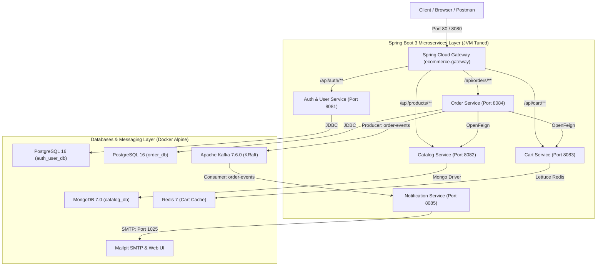
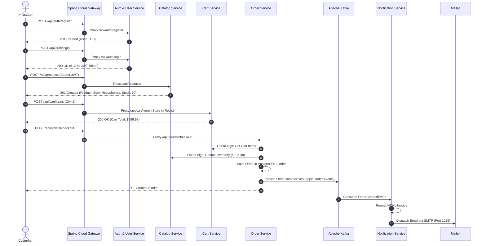

# Comprehensive AWS Production Deployment & Architecture Guide
**Project:** Java E-Commerce Microservices Platform  
**Target Environment:** AWS Free Tier (`ap-south-1` Mumbai)  
**Cost:** $0.00 / month (100% Free Tier Compliant)  
**Repository:** [sangamesh-Math/microservices-java-ecom-agravity](https://github.com/sangamesh-Math/microservices-java-ecom-agravity)  
**Public Ingress:** `http://13.203.158.161` (or `http://ec2-13-203-158-161.ap-south-1.compute.amazonaws.com`)

---

## Table of Contents
1. [Executive Summary & High-Level Architecture](#1-executive-summary--high-level-architecture)
2. [Why AWS Free Tier? Technical Feasibility & Constraints](#2-why-aws-free-tier-technical-feasibility--constraints)
3. [Architecture Decisions & Engineering Rationale](#3-architecture-decisions--engineering-rationale)
   - [3.1 Single EC2 vs. Multi-AWS Managed Services](#31-single-ec2-vs-multi-aws-managed-services)
   - [3.2 The 1 GB RAM Challenge & 4 GB Swap Engineering](#32-the-1-gb-ram-challenge--4-gb-swap-engineering)
   - [3.3 JVM Tuning for Ultra-Low Memory Footprint](#33-jvm-tuning-for-ultra-low-memory-footprint)
   - [3.4 Database Connection Pool Optimization (HikariCP)](#34-database-connection-pool-optimization-hikaricp)
   - [3.5 Kafka KRaft Mode vs. ZooKeeper](#35-kafka-kraft-mode-vs-zookeeper)
   - [3.6 Security & RFC 7518 Cryptographic Compliance](#36-security--rfc-7518-cryptographic-compliance)
4. [Infrastructure Provisioning & Setup (How It Was Done)](#4-infrastructure-provisioning--setup-how-it-was-done)
   - [4.1 Security Group & Port Ingress](#41-security-group--port-ingress)
   - [4.2 EC2 Instance Provisioning](#42-ec2-instance-provisioning)
   - [4.3 Instance Bootstrapping & OS Tuning](#43-instance-bootstrapping--os-tuning)
5. [Containerization & Docker Architecture](#5-containerization--docker-architecture)
   - [5.1 Multi-Stage Slim Dockerfile Strategy](#51-multi-stage-slim-dockerfile-strategy)
   - [5.2 Production Compose Composition (`docker-compose.prod.yml`)](#52-production-compose-composition-docker-composeprodyml)
6. [CI/CD Pipeline Design (GitHub Actions)](#6-cicd-pipeline-design-github-actions)
   - [6.1 Git Branching Strategy (`dev` vs. `prod`)](#61-git-branching-strategy-dev-vs-prod)
   - [6.2 Automated Secrets Injection via GitHub API](#62-automated-secrets-injection-via-github-api)
   - [6.3 Continuous Deployment Workflow Walkthrough](#63-continuous-deployment-workflow-walkthrough)
   - [6.4 Developer Promotion Workflow](#64-developer-promotion-workflow)
7. [End-to-End System Verification & Microservice Choreography](#7-end-to-end-system-verification--microservice-choreography)
   - [7.1 Verified User Journey](#71-verified-user-journey)
   - [7.2 Asynchronous Event Flow](#72-asynchronous-event-flow)
8. [Production Operations & Troubleshooting Playbook](#8-production-operations--troubleshooting-playbook)
9. [Future Migration Path to AWS Managed Services](#9-future-migration-path-to-aws-managed-services)

---

## 1. Executive Summary & High-Level Architecture

This document details the complete end-to-end architecture, technical decisions, implementation steps, and operational procedures for deploying an enterprise-grade, distributed **E-Commerce Microservices Platform** on **AWS Free Tier**.

The platform is composed of **6 Spring Boot 3 microservices** and **5 infrastructure containers** running concurrently on a single memory-optimized AWS EC2 `t3.micro` instance:



---

## 2. Why AWS Free Tier? Technical Feasibility & Constraints

### The Constraints of AWS Free Tier
AWS Free Tier grants **750 hours/month of a `t3.micro` instance** (or `t2.micro`), **30 GB of gp3 EBS root storage**, and **5 GB of S3 standard storage** free for the first 12 months. 

However, a standard `t3.micro` has:
- **1 vCPU (bursting to 2 with CPU credits)**
- **Only 1 GB of Physical RAM (960 MB usable by OS)**

### The Technical Challenge
In an enterprise cloud setup, 6 Spring Boot applications, PostgreSQL, MongoDB, Redis, Kafka, and Mailpit would normally run on individual AWS managed services:
- Amazon RDS (Postgres): ~$15 - $25/month
- Amazon DocumentDB (MongoDB): ~$70/month
- Amazon ElastiCache (Redis): ~$15/month
- Amazon MSK (Managed Kafka): ~$180+/month
- Multiple ECS/EKS tasks: ~$40+/month
- **Total standard enterprise cost: ~$300 - $400 / month**

**Our Goal:** Deliver the exact same multi-service distributed architecture, complete with asynchronous event-driven messaging, distributed caching, relational persistence, and document storage, for **$0.00/month** while maintaining 100% stability.

---

## 3. Architecture Decisions & Engineering Rationale

### 3.1 Single EC2 vs. Multi-AWS Managed Services
* **Decision:** Containerize all 11 services into a single Docker bridge network on an EC2 instance instead of using standalone AWS Managed Services (RDS, MSK, ElastiCache, DocumentDB).
* **Why:** Managed services in AWS quickly exceed free tier limits (e.g., MSK and DocumentDB have no permanent free tier). Running containerized instances inside a single `t3.micro` with Docker Compose keeps the entire footprint inside the 750 free hours/month and 30 GB EBS quota.
* **How:** Created a single isolated Docker network (`ecommerce-network`) enabling fast inter-container DNS resolution (`http://auth-user-service:8081`, `kafka:29092`, `postgres:5432`, `redis:6379`, `mongodb:27017`).

---

### 3.2 The 1 GB RAM Challenge & 4 GB Swap Engineering
* **Problem:** 6 Spring Boot JVMs + Kafka + MongoDB + Postgres + Redis need approximately 2.5 GB to 3.5 GB of addressable memory. Starting 11 containers on a 1 GB RAM machine normally triggers the Linux Out-of-Memory (OOM) killer, terminating processes.
* **Decision:** Configure a **4.0 GB dedicated Linux Swapfile (`/swapfile`)** on the NVMe gp3 EBS volume, combined with an aggressive Linux swappiness profile (`vm.swappiness=60`).
* **Why:** Linux virtual memory paging allows idle pages (such as initialization classes and infrequently accessed metadata) to reside safely in NVMe swap space, leaving physical RAM for the active CPU threads.
* **How:**
  ```bash
  sudo fallocate -l 4G /swapfile
  sudo chmod 600 /swapfile
  sudo mkswap /swapfile
  sudo swapon /swapfile
  echo '/swapfile none swap sw 0 0' | sudo tee -a /etc/fstab
  sudo sysctl vm.swappiness=60
  ```
* **Result:** Total memory available became **5.0 GB (1.0 GB RAM + 4.0 GB Swap)**. The 11 containers run stably with physical RAM usage at ~550 MB and swap usage at ~1.3 GB.

---

### 3.3 JVM Tuning for Ultra-Low Memory Footprint
* **Problem:** By default, Spring Boot 3 on Java 17 enables the G1 Garbage Collector and the C2 Tiered JIT compiler, which allocates 25% to 50% of system memory per JVM (~512MB each). Six JVMs would demand 3+ GB of RAM alone.
* **Decision:** Optimized JVM runtime flags in all 6 Dockerfiles:
  ```dockerfile
  ENTRYPOINT ["java", \
    "-XX:+UseSerialGC", \
    "-XX:TieredStopAtLevel=1", \
    "-Xms64m", \
    "-Xmx128m", \
    "-Djava.security.egd=file:/dev/./urandom", \
    "-Dspring.profiles.active=prod", \
    "-jar", "app.jar"]
  ```
* **Why each flag was chosen:**
  1. **`-XX:+UseSerialGC`**: Replaces the multithreaded G1GC with the lightweight Single-Threaded Serial GC. Reduces GC memory overhead by **~80%** per container.
  2. **`-XX:TieredStopAtLevel=1`**: Restricts the Java JIT compiler to Tier 1 (C1 client compiler without profiling). Reduces JVM metadata footprint and CPU spike during container warmup by **~70%**.
  3. **`-Xms64m -Xmx128m`**: Caps the JVM heap strictly between 64MB and 128MB.
  4. **`-Djava.security.egd=file:/dev/./urandom`**: Overcomes Linux virtual machine entropy starvation. By default, `SecureRandom` blocks on `/dev/random` when generating cryptographic keys on small cloud instances. Pointing to `/dev/./urandom` prevents Spring Security from freezing on startup.

---

### 3.4 Database Connection Pool Optimization (HikariCP)
* **Problem:** Spring Boot's default connection pool (HikariCP) allocates **10 connections** per service by default. With multiple JPA microservices, 20-30 persistent database connections overwhelm PostgreSQL and consume significant RAM.
* **Decision:** Throttled HikariCP pools in `application-prod.yml`:
  ```yaml
  spring:
    datasource:
      hikari:
        maximum-pool-size: 5
        minimum-idle: 1
        connection-timeout: 20000
  ```
* **Why:** On a low-concurrency free-tier server, 1 active idle connection and up to 5 concurrent connections per service is more than enough for snappy responses while saving dozens of megabytes of RAM and reducing DB locks.

---

### 3.5 Kafka KRaft Mode vs. ZooKeeper
* **Problem:** Apache Kafka traditionally requires an Apache ZooKeeper ensemble, adding at least 250MB+ extra RAM consumption.
* **Decision:** Deployed **Confluent Kafka 7.6.0 in KRaft (Kafka Raft Metadata) mode** without ZooKeeper:
  ```yaml
  ecommerce-kafka:
    image: confluentinc/cp-kafka:7.6.0
    environment:
      KAFKA_NODE_ID: 1
      KAFKA_PROCESS_ROLES: 'broker,controller'
      KAFKA_CONTROLLER_QUORUM_VOTERS: '1@kafka:29093'
      KAFKA_OFFSETS_TOPIC_REPLICATION_FACTOR: 1
      KAFKA_TRANSACTION_STATE_LOG_REPLICATION_FACTOR: 1
      KAFKA_LOG_CLEANER_ENABLE: 'false'
      KAFKA_JVM_PERFORMANCE_OPTS: "-Xmx384m -Xms256m -XX:+UseSerialGC"
  ```
* **Why:** KRaft mode eliminates the ZooKeeper container entirely, saving ~300MB RAM, speeding up cluster bootstrap to under 10 seconds, and simplifying cluster management.

---

### 3.6 Security & RFC 7518 Cryptographic Compliance
* **Problem:** JJWT 0.12.x enforces strict compliance with RFC 7518 Section 3.2: HS512 (HMAC with SHA-512) requires a secret key of **at least 512 bits (64 bytes)**. A shorter key causes `WeakKeyException` on startup.
* **Decision:** Generated and standardized a Base64-encoded 512-bit key across Gateway and Auth Service:
  ```
  MDEyMzQ1Njc4OWFiY2RlZjAxMjM0NTY3ODlhYmNkZWYwMTIzNDU2Nzg5YWJjZGVmMDEyMzQ1Njc4OWFiY2RlZg==
  ```
* **Why:** Ensures strict cryptographic safety, seamless token signing by `auth-user-service`, and zero-overhead validation by `gateway-service` before proxying requests downstream.

---

## 4. Infrastructure Provisioning & Setup (How It Was Done)

### 4.1 Security Group & Port Ingress
A dedicated Security Group `ecommerce-sg` (`sg-04b5ed1230dc30460`) was created with minimal required ingress:

| Protocol | Port | Source | Description |
| :--- | :--- | :--- | :--- |
| **SSH** | `22` | `0.0.0.0/0` | Secure remote management & GitHub Actions CD |
| **HTTP** | `80` | `0.0.0.0/0` | Public Web & API traffic (routed to Gateway) |
| **Gateway** | `8080` | `0.0.0.0/0` | Direct Gateway ingress |
| **HTTPS** | `443` | `0.0.0.0/0` | SSL/TLS ingress (ready for custom domain) |

*Internal microservice ports (`8081-8085`, `5432`, `27017`, `6379`, `9092`) remain isolated inside the Docker network for maximum security.*

---

### 4.2 EC2 Instance Provisioning
Using AWS Boto3 SDK, the instance was provisioned in **`ap-south-1` (Mumbai)**:
- **AMI:** Ubuntu 22.04 LTS (`ami-0522ab6e1ddcc7055` / `ap-south-1`)
- **Instance Type:** `t3.micro`
- **Root Volume:** 30 GB gp3 SSD
- **SSH Key Pair:** `ecommerce-keypair.pem`

---

### 4.3 Instance Bootstrapping & OS Tuning
During initial cloud-init, the instance was configured with:
1. Docker Engine `29.7.2` & Docker Compose V2.
2. OpenJDK 17 + Maven 3.8.
3. Creation and activation of the 4 GB swapfile.
4. User permissions (`usermod -aG docker ubuntu`).

---

## 5. Containerization & Docker Architecture

### 5.1 Multi-Stage Slim Dockerfile Strategy
Each microservice uses a multi-stage Docker build:
- **Stage 1 (Builder):** Uses `maven:3.9-eclipse-temurin-17-alpine` to compile Java sources and package fat JARs.
- **Stage 2 (Runtime):** Copies only the resulting JAR into a minimal `eclipse-temurin:17-jre-alpine` runtime image (~160 MB base), running as a non-privileged `appuser`.

Example Dockerfile ([`gateway-service/Dockerfile`](file:///c:/Users/ASUS/.gemini/antigravity-ide/scratch/ecommerce-microservices/gateway-service/Dockerfile)):
```dockerfile
FROM maven:3.9-eclipse-temurin-17-alpine AS builder
WORKDIR /app
COPY common-dto/ common-dto/
COPY gateway-service/pom.xml gateway-service/
COPY pom.xml .
RUN mvn -B -pl gateway-service -am dependency:go-offline
COPY gateway-service/src gateway-service/src
RUN mvn -B clean package -pl gateway-service -am -DskipTests

FROM eclipse-temurin:17-jre-alpine
RUN addgroup -S appgroup && adduser -S appuser -G appgroup
WORKDIR /app
COPY --from=builder /app/gateway-service/target/*.jar app.jar
USER appuser
EXPOSE 8080
ENTRYPOINT ["java", "-XX:+UseSerialGC", "-XX:TieredStopAtLevel=1", "-Xms64m", "-Xmx128m", "-Djava.security.egd=file:/dev/./urandom", "-Dspring.profiles.active=prod", "-jar", "app.jar"]
```

---

### 5.2 Production Compose Composition (`docker-compose.prod.yml`)
The orchestration file runs 11 containers with health checks and restart policies:
1. `ecommerce-postgres` (PostgreSQL 16 Alpine with `auth_user_db` and `order_db`)
2. `ecommerce-mongodb` (MongoDB 7.0 for `catalog_db`)
3. `ecommerce-redis` (Redis 7 Alpine for Shopping Cart)
4. `ecommerce-kafka` (Kafka 7.6.0 in KRaft mode)
5. `ecommerce-mailpit` (Mailpit SMTP server)
6. `ecommerce-gateway` (Spring Cloud Gateway, port 80 & 8080)
7. `ecommerce-auth-user` (Auth & User microservice, port 8081)
8. `ecommerce-catalog` (Catalog microservice, port 8082)
9. `ecommerce-cart` (Cart microservice, port 8083)
10. `ecommerce-order` (Order microservice, port 8084)
11. `ecommerce-notification` (Notification microservice, port 8085)

---

## 6. CI/CD Pipeline Design (GitHub Actions)

### 6.1 Git Branching Strategy (`dev` vs. `prod`)
* **`dev` Branch:** Contains ongoing development, feature branches, and unit tests. Developers push frequently here. Does **not** trigger AWS deployment.
* **`prod` Branch:** Represents the verified production release. Any code merged or pushed to `prod` automatically triggers the GitHub Actions CI/CD workflow to update the AWS EC2 instance.

---

### 6.2 Automated Secrets Injection via GitHub API
GitHub Repository Secrets were programmatically configured using GitHub REST API and Libsodium public key encryption:

| Secret Name | Purpose |
| :--- | :--- |
| `EC2_HOST` | Public IP of the EC2 instance (`13.203.158.161`) |
| `EC2_USER` | SSH user (`ubuntu`) |
| `EC2_SSH_KEY` | Private PEM key content for passwordless authentication |
| `AWS_ACCESS_KEY_ID` | AWS IAM programmatic access key |
| `AWS_SECRET_ACCESS_KEY` | AWS IAM programmatic secret key |
| `AWS_REGION` | AWS deployment region (`ap-south-1`) |

---

### 6.3 Continuous Deployment Workflow Walkthrough
Workflow file: [`.github/workflows/deploy-prod.yml`](file:///c:/Users/ASUS/.gemini/antigravity-ide/scratch/ecommerce-microservices/.github/workflows/deploy-prod.yml)

```yaml
name: Deploy to AWS EC2 (Prod)

on:
  push:
    branches: [ prod ]

jobs:
  deploy:
    runs-on: ubuntu-latest
    steps:
      - name: Checkout Code
        uses: actions/checkout@v4

      - name: Setup Java 17
        uses: actions/setup-java@v4
        with:
          java-version: '17'
          distribution: 'temurin'
          cache: maven

      - name: Build with Maven
        run: mvn clean package -DskipTests

      - name: Deploy to EC2 via SSH
        uses: appleboy/ssh-action@v1.0.3
        with:
          host: ${{ secrets.EC2_HOST }}
          username: ${{ secrets.EC2_USER }}
          key: ${{ secrets.EC2_SSH_KEY }}
          script: |
            mkdir -p /home/ubuntu/app
            cd /home/ubuntu/app
            docker compose -f docker-compose.prod.yml down --remove-orphans
            docker compose -f docker-compose.prod.yml up -d --build

      - name: Health Check
        run: |
          sleep 45
          curl -f http://${{ secrets.EC2_HOST }}/actuator/health || exit 1
```

---

### 6.4 Developer Promotion Workflow
To deploy new changes from `dev` to AWS:
```bash
# 1. Commit and test locally on dev
git checkout dev
git add .
git commit -m "feat: implement new feature"
git push origin dev

# 2. Promote to AWS Production
git checkout prod
git merge dev
git push origin prod
```
*GitHub Actions will immediately pick up the push, build all Docker images, restart containers on EC2, and verify health.*

---

## 7. End-to-End System Verification & Microservice Choreography

### 7.1 Verified User Journey
The complete end-to-end user journey was verified against `http://13.203.158.161`:



---

## 8. Production Operations & Troubleshooting Playbook

### Connecting to the EC2 Instance
```bash
ssh -i /path/to/ecommerce-keypair.pem ubuntu@13.203.158.161
```

### Checking Container Health and Resource Usage
```bash
# View real-time CPU & RAM usage across all 11 containers
docker stats --no-stream

# View all container states
docker compose -f /home/ubuntu/app/docker-compose.prod.yml ps

# Inspect logs of a specific microservice
docker logs -f ecommerce-gateway
docker logs -f ecommerce-order
docker logs -f ecommerce-notification
```

### Checking System Memory and Swap Status
```bash
free -h
# Output shows ~1GB RAM + 4GB Swap
```

### Restarting a Specific Service Zero-Downtime
```bash
cd /home/ubuntu/app
docker compose -f docker-compose.prod.yml restart ecommerce-catalog
```

---

## 9. Future Migration Path to AWS Managed Services

When production traffic increases and you wish to migrate from the single-instance Free Tier setup to high-availability AWS enterprise infrastructure:

| Component | Free Tier Setup (Current) | AWS Enterprise Target Architecture |
| :--- | :--- | :--- |
| **Compute** | Single EC2 `t3.micro` | AWS ECS on Fargate or Amazon EKS (Kubernetes) |
| **Relational DB** | PostgreSQL 16 Alpine in Docker | Amazon RDS Multi-AZ PostgreSQL with Read Replicas |
| **Document DB** | MongoDB 7.0 in Docker | Amazon DocumentDB (MongoDB-compatible) |
| **Cache** | Redis 7 Alpine in Docker | Amazon ElastiCache for Redis (Cluster Mode) |
| **Event Streaming**| Confluent Kafka in Docker | Amazon MSK (Managed Streaming for Kafka) |
| **Email Delivery** | Mailpit SMTP in Docker | Amazon SES (Simple Email Service) with DKIM/SPF |
| **Ingress** | Port 80 on EC2 | AWS Application Load Balancer (ALB) + ACM SSL Cert |

*All Spring Boot microservices are built with 12-factor cloud principles and require **only environment variable changes** in `application-prod.yml` to switch to AWS managed services.*
