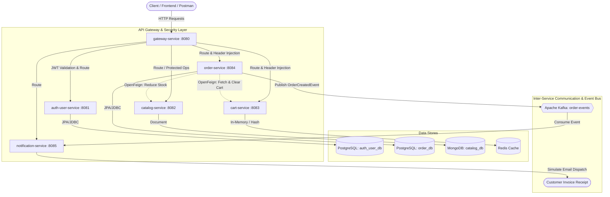

# Event-Driven E-Commerce Microservices Platform

A production-grade, highly scalable, event-driven e-commerce platform built with **Java 17**, **Spring Boot 3.3.x**, **Spring Cloud 2023.x**, and polyglot persistence (**PostgreSQL**, **MongoDB**, **Redis**), featuring API Gateway routing, JWT authentication, OpenFeign synchronous communication, and asynchronous event streaming via **Apache Kafka**.

---

## 🏛 Architecture Diagram



---

## 🚀 Microservices Topology

| Service | Port | Database / Storage | Key Responsibilities |
| :--- | :--- | :--- | :--- |
| **`gateway-service`** | `8080` | None | Spring Cloud Gateway, Global JWT Authentication Filter, CORS, Route Definitions |
| **`auth-user-service`**| `8081` | PostgreSQL (`auth_user_db`) | Spring Security 6, JJWT Token Provider, User Registration, Login, Token Validation |
| **`catalog-service`**  | `8082` | MongoDB (`catalog_db`) | Product Catalog CRUD, Category Filtering, Stock Verification & Atomic Deductions |
| **`cart-service`**     | `8083` | Redis | Session Shopping Cart, Add/Remove/Update items, Automatic TTL expiration (72h) |
| **`order-service`**    | `8084` | PostgreSQL (`order_db`) | OpenFeign Client to Catalog & Cart, Transactional Checkout, Kafka Event Producer |
| **`notification-service`** | `8085` | In-Memory / Audit Queue | Kafka Consumer for `OrderCreatedEvent`, Simulated Email/SMS Dispatch |
| **`common-library`**  | Library | None | Shared DTOs (`ApiResponse`, `ErrorResponse`, `UserPrincipalDto`), Events (`OrderCreatedEvent`), Domain Exceptions |

---

## 🛠 Technology Stack & Prerequisites

- **Java Development Kit (JDK)**: Java 17+
- **Build Tool**: Maven Multi-Module (Self-bootstrapping `mvnw.cmd` / `mvnw.ps1` / `mvnw` included)
- **Containerization**: Docker & Docker Compose
- **Frameworks**:
  - Spring Boot 3.3.4
  - Spring Cloud 2023.0.3 (Gateway, OpenFeign)
  - Spring Security 6 + JJWT 0.12.5
  - Spring Data JPA (Hibernate 6)
  - Spring Data MongoDB
  - Spring Data Redis
  - Spring Kafka

---

## 📦 Project Directory Layout

```
ecommerce-microservices/
├── pom.xml                               # Root Multi-Module Maven Configuration
├── mvnw / mvnw.cmd / mvnw.ps1            # Self-bootstrapping Maven Wrapper
├── docker-compose.yml                    # Containerized Postgres, Mongo, Redis, Kafka
├── docker/
│   └── init-db.sql                       # PostgreSQL database initialization script
├── common-library/                       # Shared DTOs, Events, Exceptions
│   ├── pom.xml
│   └── src/main/java/com/ecommerce/common/
├── auth-user-service/                    # Auth & User Microservice (Port 8081)
│   ├── pom.xml
│   └── src/main/java/com/ecommerce/auth/
├── catalog-service/                      # Product Catalog Microservice (Port 8082)
│   ├── pom.xml
│   └── src/main/java/com/ecommerce/catalog/
├── cart-service/                         # Shopping Cart Microservice (Port 8083)
│   ├── pom.xml
│   └── src/main/java/com/ecommerce/cart/
├── order-service/                        # Order Management Microservice (Port 8084)
│   ├── pom.xml
│   └── src/main/java/com/ecommerce/order/
├── notification-service/                 # Async Kafka Notification Microservice (Port 8085)
│   ├── pom.xml
│   └── src/main/java/com/ecommerce/notification/
└── gateway-service/                      # API Gateway Microservice (Port 8080)
    ├── pom.xml
    └── src/main/java/com/ecommerce/gateway/
```

---

## ⚡ Getting Started

### 1. Start Infrastructure Containers
Start PostgreSQL, MongoDB, Redis, and Apache Kafka in the background:
```bash
docker compose up -d
```

Verify that all 4 containers are healthy:
```bash
docker compose ps
```

### 2. Build the Multi-Module Project
Run Maven compilation and test suite from the root directory:
```bash
# Windows PowerShell
.\mvnw.ps1 clean test

# Windows CMD
mvnw.cmd clean test

# Linux / macOS
./mvnw clean test
```

### 3. Run Microservices
You can run each service independently using Spring Boot Maven plugin:

```bash
# Terminal 1: Auth & User Service
.\mvnw.ps1 -pl auth-user-service spring-boot:run

# Terminal 2: Catalog Service
.\mvnw.ps1 -pl catalog-service spring-boot:run

# Terminal 3: Cart Service
.\mvnw.ps1 -pl cart-service spring-boot:run

# Terminal 4: Order Service
.\mvnw.ps1 -pl order-service spring-boot:run

# Terminal 5: Notification Service
.\mvnw.ps1 -pl notification-service spring-boot:run

# Terminal 6: API Gateway
.\mvnw.ps1 -pl gateway-service spring-boot:run
```

---

## 📡 API Reference & End-to-End Workflow

All requests can be routed through the **API Gateway** (`http://localhost:8080`).

### 1. User Registration & Authentication
#### Register a new user:
```bash
curl -X POST http://localhost:8080/api/auth/register \
  -H "Content-Type: application/json" \
  -d '{
    "email": "customer@example.com",
    "password": "Password123!",
    "fullName": "Alice Johnson",
    "role": "ROLE_USER"
  }'
```

#### Login to obtain JWT token:
```bash
curl -X POST http://localhost:8080/api/auth/login \
  -H "Content-Type: application/json" \
  -d '{
    "email": "customer@example.com",
    "password": "Password123!"
  }'
```
*Save the returned `data.token` as `TOKEN` for subsequent protected requests.*

---

### 2. Product Catalog Operations
#### Create a product (Protected):
```bash
curl -X POST http://localhost:8080/api/products \
  -H "Content-Type: application/json" \
  -H "Authorization: Bearer <TOKEN>" \
  -d '{
    "name": "Mechanical Gaming Keyboard",
    "description": "RGB Backlit Mechanical Keyboard with tactile switches",
    "price": 129.99,
    "stockQuantity": 50,
    "category": "Peripherals",
    "imageUrl": "https://example.com/keyboard.png"
  }'
```

#### Browse products (Public):
```bash
curl -X GET http://localhost:8080/api/products
```

---

### 3. Shopping Cart Operations
#### Add product to cart (Protected):
```bash
curl -X POST http://localhost:8080/api/cart/items \
  -H "Content-Type: application/json" \
  -H "Authorization: Bearer <TOKEN>" \
  -d '{
    "productId": "<PRODUCT_ID>",
    "productName": "Mechanical Gaming Keyboard",
    "unitPrice": 129.99,
    "quantity": 2,
    "imageUrl": "https://example.com/keyboard.png"
  }'
```

#### View Cart (Protected):
```bash
curl -X GET http://localhost:8080/api/cart \
  -H "Authorization: Bearer <TOKEN>"
```

---

### 4. Order Checkout & Async Notification Flow
#### Place Order from Cart (Protected):
```bash
curl -X POST http://localhost:8080/api/orders/checkout \
  -H "Content-Type: application/json" \
  -H "Authorization: Bearer <TOKEN>" \
  -d '{
    "shippingAddress": "742 Evergreen Terrace, Springfield",
    "customerEmail": "customer@example.com"
  }'
```

#### What Happens Under the Hood:
1. **`gateway-service`** validates the JWT token, extracts `userId` and `email`, and mutates request headers with `X-User-Id` and `X-User-Email`.
2. **`order-service`** receives the request and calls **`cart-service`** via OpenFeign to fetch the user's cart.
3. For each item in the cart, **`order-service`** calls **`catalog-service`** via OpenFeign to atomically deduct the inventory stock.
4. **`order-service`** saves the `Order` entity with status `CONFIRMED` to PostgreSQL and clears the cart in Redis.
5. **`order-service`** publishes an `OrderCreatedEvent` to Kafka topic `order-events`.
6. **`notification-service`** consumes the `OrderCreatedEvent` from Kafka, logs the structured dispatch, and simulates sending an email invoice.

#### View Notification Audit (Notification Service):
```bash
curl -X GET http://localhost:8080/api/notifications/recent
```
